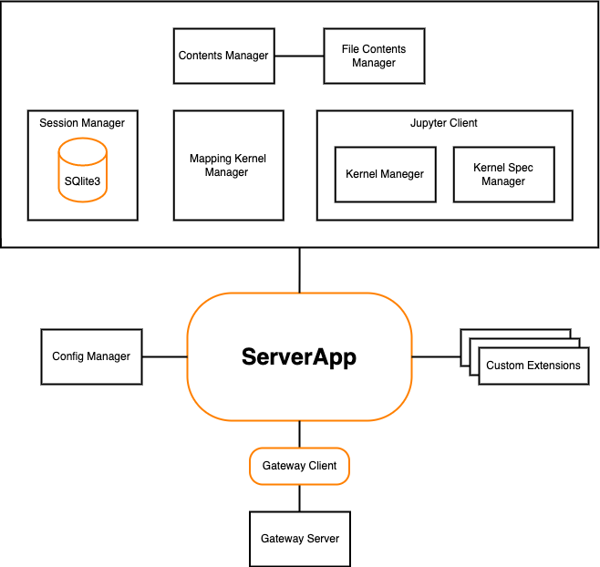

.. _architecture:

Architecture Diagrams
=====================

This page describes the Jupyter Server architecture and the main workflows.
This information is useful for developers who want to understand how Jupyter
Server components are connected and how the principal workflows look like.

To make changes for these diagrams, use `the Draw.io <https://app.diagrams.net/>`_
open source tool.

Jupyter Server Architecture
---------------------------

The Jupyter Server system can be seen in figure bellow:

Jupyter Server contains the following components:

- **ServerApp** is the main Tornado-based application which connects all
  components together.

- **Config Manager** initializes configuration for the ServerApp. You can define
  custom classes for the Jupyter Server managers using this config and change
  SererApp settings. Follow :ref:`the Config File Guide <other-full-config>` to
  learn about configuration settings and how to build custom config.

- **Custom Extensions** allow to create the custom Server's REST API endpoint.
  Follow :ref:`the Extension Guide <extensions>` to know more about extending
  ServerApp with extra request handlers.

- **Kernel Gateway** is the web server that provides access to Jupyter Kernels.
  There are different ways to create this gateway. If your ServerApp needs to
  communicate with remote Kernels, you can use
  `the Enterprise Gateway <https://github.com/jupyter-server/enterprise_gateway>`_,
  otherwise you can use `the Kernel Gateway <https://github.com/jupyter-server/kernel_gateway>`_.

- **Contents Manager and File Contents Manager** are responsible for serving
  Notebook on the file system. Session Manager uses Contents Manager to receive
  Kernel path. Follow :ref:`the Contents API guide <contents_api>` to learn
  about Contents Manager.

- **Session Manager** processes users Sessions. When user starts a new Kernel,
  Session Manager starts a process to provision Kernel for the user and generates
  a new Session ID. Each opened Notebook has a separate Session, but different
  Notebook Kernels can use the same Session. That is useful if user wants to
  share data across various opened Notebooks. Session Manager uses SQLite3
  DataBase to store the Sessions.

- **Mapping Kernel Manager** is responsible to operate multiple Kernels in the
  ServerApp. It starts a new Kernel for a user's Session and generates a
  new Kernel ID.

- **Kernel Spec Manager** parses file with JSON specification for a Kernel.
  To know more about Kernel Spec, follow
  `the Jupyter Client guide <https://jupyter-client.readthedocs.io/en/stable/kernels.html#kernel-specs>`_.
