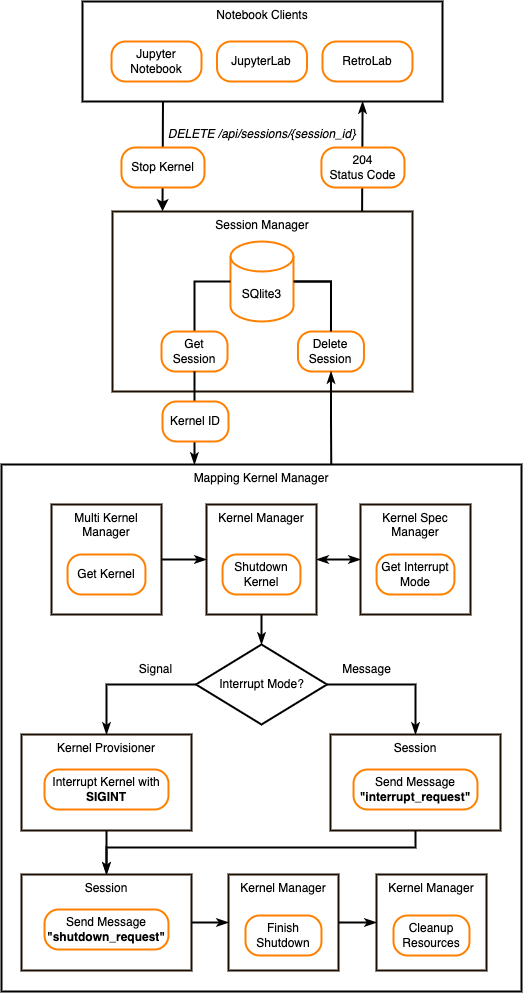

.. _architecture:

Architecture Diagrams
=====================

This page describes the Jupyter Server architecture and the main workflows.
This information is useful for developers who want to understand how Jupyter
Server components are connected and how the principal workflows look like.

To make changes for these diagrams, use `the Draw.io <https://app.diagrams.net/>`_
open source tool to edit the png file.

Jupyter Server Architecture
---------------------------

The Jupyter Server system can be seen in the figure below:

Jupyter Server contains the following components:

- **ServerApp** is the main Tornado-based application which connects all
  components together.

- **Config Manager** initializes configuration for the ServerApp. You can define
  custom classes for the Jupyter Server managers using this config and change
  SererApp settings. Follow :ref:`the Config File Guide <other-full-config>` to
  learn about configuration settings and how to build custom config.

- **Custom Extensions** allow you to create the custom Server's REST API endpoints.
  Follow :ref:`the Extension Guide <extensions>` to know more about extending
  ServerApp with extra request handlers.

- **Gateway Server** is a web server that, when configured, provides access to
  Jupyter kernels running on other hosts. There are different ways to create a
  gateway server. If your ServerApp needs to communicate with remote kernels
  residing within resource-managed clusters, you can use
  `Enterprise Gateway <https://github.com/jupyter-server/enterprise_gateway>`_,
  otherwise, you can use
  `Kernel Gateway <https://github.com/jupyter-server/kernel_gateway>`_, where
  kernels run locally to the gateway server.

- **Contents Manager and File Contents Manager** are responsible for serving
  Notebook on the file system. Session Manager uses Contents Manager to receive
  kernel path. Follow :ref:`the Contents API guide <contents_api>` to learn
  about Contents Manager.

- **Session Manager** processes users' Sessions. When a user starts a new kernel,
  Session Manager starts a process to provision kernel for the user and generates
  a new Session ID. Each opened Notebook has a separate Session, but different
  Notebook kernels can use the same Session. That is useful if the user wants to
  share data across various opened Notebooks. Session Manager uses SQLite3
  database to store the Session information. The database is stored in memory by
  default, but can be configured to save to disk.

- **Mapping Kernel Manager** is responsible for managing the lifecycles of the
  kernels running within the ServerApp. It starts a new kernel for a user's Session
  and facilitates interrupt, restart, and shutdown operations against the kernel.

- **Jupyter Client** library is used by Jupyter Server to work with the Notebook
  kernels.

  - **Kernel Manager** manages a single kernel for the Notebook. To know more about
    Kernel Manager, follow
    `the Jupyter Client APIs documentation <https://jupyter-client.readthedocs.io/en/latest/api/manager.html#jupyter_client.KernelManager>`_.

  - **Kernel Spec Manager** parses files with JSON specification for a kernels,
    and provides a list of available kernel configurations. To learn about
    Kernel Spec Manager, check `the Jupyter Client guide <https://jupyter-client.readthedocs.io/en/stable/kernels.html#kernel-specs>`_.

Create Session Workflow
-----------------------

The create Session workflow can be seen in the figure below:

When a user starts a new kernel, the following steps occur:

#. The Notebook client sends |create_session|_ request to Jupyter Server. This
   request has all necessary data, such as Notebook name, type, path, and kernel
   name.

#. **Session Manager** asks **Contents Manager** for the kernel file system path
   based on the input data.

#. **Session Manager** sends kernel path to **Mapping Kernel Manager**.

#. **Mapping Kernel Manager** starts the kernel create process by using
   **Multi Kernel Manager** and **Kernel Manager**. You can learn more about
   **Multi Kernel Manager** in
   `the Jupyter Client APIs <https://jupyter-client.readthedocs.io/en/latest/api/manager.html#multikernelmanager-controlling-multiple-kernels>`_.

#. **Kernel Manager** uses the provisioner layer to launch a new kernel.

#. **Kernel Provisioner** is responsible for launching kernels based on the
   kernel specification. If the kernel specification doesn't define a provisioner,
   it uses `Local Provisioner <https://jupyter-client.readthedocs.io/en/latest/api/provisioners.html#jupyter_client.provisioning.local_provisioner.LocalProvisioner>`_
   to launch the kernel. You can use
   `Kernel Provisioner Base <https://jupyter-client.readthedocs.io/en/latest/api/provisioners.html#jupyter_client.provisioning.provisioner_base.KernelProvisionerBase>`_
   and
   `Kernel Provisioner Factory <https://jupyter-client.readthedocs.io/en/latest/api/provisioners.html#jupyter_client.provisioning.factory.KernelProvisionerFactory>`_
   to create custom provisioners.

#. **Kernel Spec Manager** gets the kernel specification from the JSON file.
   The specification is located in ``kernel.json`` file.

#. Once **Kernel Provisioner** launches the kernel,
   **Kernel Manager** generates the new kernel ID for **Session Manager**.

#. **Session Manager** saves the new Session data to the SQLite3 database
   (Session ID, Notebook path, Notebook name, Notebook type, and kernel ID).

#. Notebook client receives the created Session data.

.. _create_session: https://petstore.swagger.io/?url=https://raw.githubusercontent.com/jupyter/jupyter_server/master/jupyter_server/services/api/api.yaml#/sessions/post_api_sessions

.. |create_session| replace:: the *POST /api/sessions*

Delete Session Workflow
-----------------------

The delete Session workflow can be seen in the figure below:

When a user stops a kernel, the following steps occur:

#. The Notebook client sends |delete_session|_ request to Jupyter Server. This
   request has the Session ID that kernel is currently using.

#. **Session Manager** gets the Session data from the SQLite3 database and sends
   the kernel ID to **Mapping Kernel Manager**.

#. **Mapping Kernel Manager** starts the kernel shutdown process by using
   **Multi Kernel Manager** and **Kernel Manager**.

#. **Kernel Manager** determines the mode of interrupt from the
   **Kernel Spec Manager**. It supports ``Signal`` and ``Message``
   interrupt modes. By default, the ``Signal`` interrupt mode is being used.

   - When the interrupt mode is ``Signal``, the **Kernel Provisioner**
     interrupts the kernel with the ``SIGINT`` operating system signal
     (although other provisioner implementations may use a different approach).

   - When interrupt mode is ``Message``, Session sends
     the `"interrupt_request" <https://jupyter-client.readthedocs.io/en/latest/messaging.html#msging-interrupt>`_
     message on the control channel.

#. After interrupting kernel, Session sends the `"shutdown_request" <https://jupyter-client.readthedocs.io/en/latest/messaging.html#kernel-shutdown>`_
   message on the control channel.

#. **Kernel Manager** waits for the kernel shutdown. After the timeout, and if
   it detects the kernel process is still running, the **Kernel Manager**
   terminates the kernel sending a ``SIGTERM`` operating system signal
   (or provisioner equivalent). If it finds the kernel process has
   not terminated, the **Kernel Manager** will follow up with a ``SIGKILL``
   operating system signal (or provisioner equivalent) to ensure the kernel's
   termination.

#. **Kernel Manager** cleans up the kernel resources. It removes kernel's interprocess
   communication ports, closes control socket, and releases Shell, IOPub, StdIn,
   Control, and Heartbeat ports.

#. When shutdown is finished, **Session Manager** deletes the Session data from
   the SQLite3 database and responses 204 status code to the Notebook client.

.. _delete_session: https://petstore.swagger.io/?url=https://raw.githubusercontent.com/jupyter/jupyter_server/master/jupyter_server/services/api/api.yaml#/sessions/delete_api_sessions__session_

.. |delete_session| replace:: the *DELETE /api/sessions/{session_id}*
